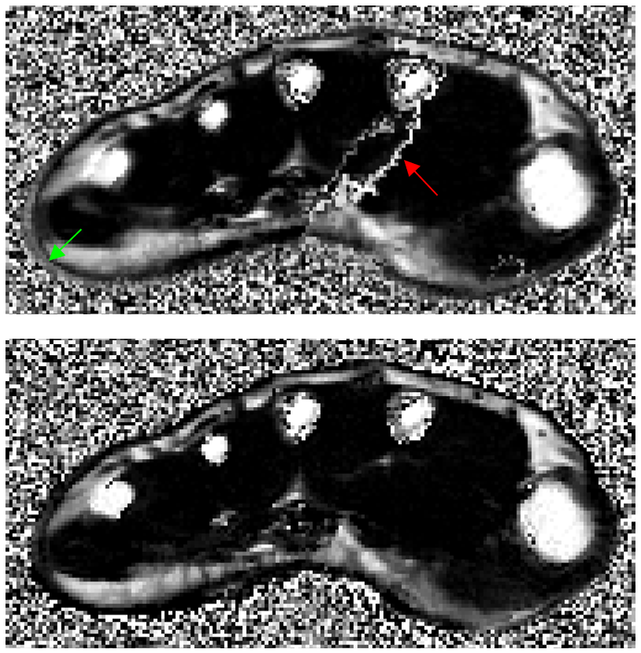

# Change Log

All notable changes to this project will be documented in this file.

## [release-1.2.1](https://github.com/SWastling/musclemap/releases/tag/1.2.0) - 2024-12-13

### Changed

- Corrected list of intermediate files to delete in coreg_dixon() function in ff.py

## [release-1.2.0](https://github.com/SWastling/musclemap/tree/release-1.2.0) - 2024-12-13

### Changed

- Updated tests to improve coverage of individual functions
- Previously registration of Dixon images was achieved by calculating the rigid
transformation of magnitude images to one another and then applying the 
transformation to the phase images. This resulted in two problems
  - mis-registrations as shown by the green arrow in the image below
  - phase discontinuity artefacts as shown by the red arrow in the image below
- Now using affine transformations applied to real and imaginary images to 
resolve both issues. 

## [release-1.1.1](https://github.com/SWastling/musclemap/tree/release-1.1.1) - 2024-11-27

### Changed

- Switched from tox to uv and ruff 
- Updated to Python 3.13

## [release-1.1.0](https://github.com/SWastling/musclemap/tree/release-1.1.0) - 2022-07-15

### Added

- Added ability to process fat-fraction data from Philips MRI systems

### Changed

- Updated README 

## [release-1.0.1](https://github.com/SWastling/musclemap/tree/release-1.0.1) - 2022-01-25

### Changed

- Changed structure of project to enable creation of package which can be 
installed with [pip](https://pypi.org/project/pip/)
- Removed in-line version checking of libraries as now recommend installation in 
virtual environment with package versions specified in the
[setup.cfg](https://docs.python.org/3/distutils/configfile.html) file

### Added
- Testing and packing automation with [tox](https://pypi.org/project/tox/)
- Import sorting with [isort](https://pycqa.github.io/isort/)
- Code formatting with [black](https://pypi.org/project/black/) 
- Style-guide enforcement with [flake8](https://flake8.pycqa.org)
- Test coverage reports with [pytest-cov](https://pypi.org/project/pytest-cov/)
- Further unit and integration tests to ensure 100% coverage

## [release-1.0.0](https://github.com/SWastling/musclemap/tree/release-1.0.0) - 2021-06-11

- Initial release of working, tested code
